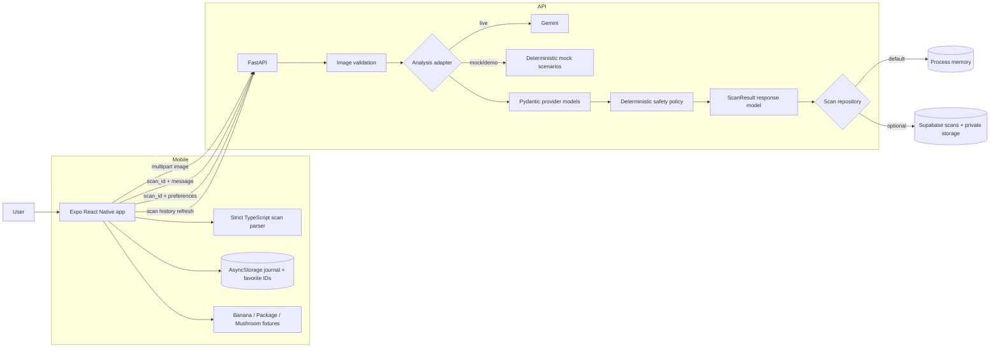
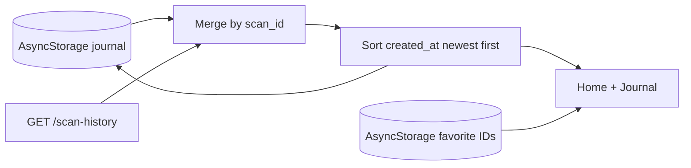
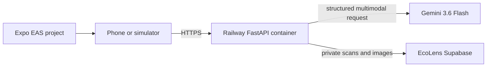

# EcoLens architecture

**Document type:** Implemented MVP architecture, audited against the repository  
**Stack:** Expo React Native · FastAPI · Pydantic · Gemini adapter · AsyncStorage · optional Supabase  
**Canonical scan contract:** [`../contracts/scan-result.schema.json`](../contracts/scan-result.schema.json)

## 1. Architectural goals

1. Keep provider output behind typed parsing and deterministic safety policy.
2. Use one scan shape across the API, mobile runtime parser, local fixtures, and tests.
3. Make fixture/fallback results visibly distinguishable from live results.
4. Keep Gemini and Supabase privileged credentials off the mobile device.
5. Preserve uncertainty, safety, provenance, and analysis metadata in every saved scan.
6. Remain runnable without external credentials.

## 2. Implemented system context



There is no mobile-to-Supabase path and no sign-in/account component in the shipped MVP. The mobile bundle only needs `EXPO_PUBLIC_API_URL` for API access.

### Responsibility split

| Layer | Implemented responsibilities | Explicitly not implemented there |
|---|---|---|
| Expo app | Camera/library flow, image preparation, strict result parsing, result/safety UI, local journal/favorites, remote history merge, local fallback answers | Provider keys, Supabase service key, server recipe authorization |
| FastAPI | Route validation, image validation, adapter orchestration, timeouts, safety policy, scan retrieval/history, chat/recipe gating, repository selection | Account/session ownership and journal/favorite CRUD |
| `GeminiAdapter` | Gemini request translation, schema-constrained output request, Pydantic parsing for analysis/chat/recipes | Final safety decision or persistence |
| `MockAnalysisAdapter` | Deterministic Banana, Doritos, and Mushroom drafts plus mock chat/recipes | Pretending fixture output is live inference |
| Scan repository | Save/get/list scans and optionally store images | Favorites, chat-history persistence, annotations, deletion |
| AsyncStorage | Device-local journal entries and favorite scan IDs | Cross-device sync or user isolation |
| Optional Supabase | `scans` persistence and private image storage through the API repository | A current remote favorites/chat API |

## 3. Configuration and runtime modes

### 3.1 Credential-free default

With the defaults in `Settings`:

- `mock_mode=true` selects `MockAnalysisAdapter`;
- no Supabase configuration selects `InMemoryScanRepository`;
- the API is fully runnable without Gemini or Supabase credentials;
- scan history is process-local and is lost on restart; and
- image bytes are validated but not retained by the memory repository.

### 3.2 Live Gemini mode

Set `ECOLENS_MOCK_MODE=false` and `GEMINI_API_KEY`. `GEMINI_MODEL` defaults to `gemini-3.6-flash`. `GeminiAdapter` requests JSON using a Pydantic-derived response schema and validates the returned JSON with Pydantic.

### 3.3 Optional Supabase mode

When `SUPABASE_URL` and a service-role or other configured key are present, startup selects `SupabaseScanRepository`. It upserts/reads/lists `scans` and uploads images to the configured private bucket. If repository construction fails at startup, the API logs the failure and uses memory; failures after successful construction return storage/persistence errors rather than silently switching repositories.

### 3.4 Demo scenarios

- Backend `/analyze-image` accepts optional form or query `demo_scenario=banana|mushroom|doritos` and routes that request through the mock adapter.
- The mobile development Home screen directly exposes Banana, Package, and Mushroom fixtures.
- Mobile analysis failures or missing API configuration automatically return a clearly disclosed local demo result inferred from the file name/hint (Banana by default).

There is no shipped global fixture toggle. Demo behavior must be described as the scenario buttons and automatic disclosed fallback that actually exist.

## 4. Scan request lifecycle

1. **Capture or select** — `ScannerScreen` obtains one image.
2. **Prepare on device** — source validation checks the available MIME/size/dimensions, resizes the long edge to at most 1600 px, removes source metadata by re-encoding, and outputs JPEG.
3. **Upload** — mobile sends multipart field `image` to `POST /analyze-image`. It does not send a token or category.
4. **Validate at API edge** — FastAPI allows JPEG, PNG, or WebP; reads in 64 KiB chunks; enforces the configured byte limit; decodes the image; verifies declared versus detected format; and enforces a 25-megapixel limit.
5. **Analyze** — the selected adapter receives image bytes and content type under the configured total timeout.
6. **Parse provider output** — the live adapter validates JSON into `AnalysisDraft`; mock scenarios are constructed as the same Pydantic type.
7. **Apply safety policy** — the service copies the draft, normalizes confidence labels, escalates unsafe states, removes blocked recipes/medical-advice patterns, and computes `chat_available`.
8. **Store image** — memory mode discards bytes and returns no URL; Supabase mode uploads to the private bucket and returns a one-hour signed URL.
9. **Build canonical result** — the service authors UUID, timestamp, model, prompt version, mock flag, and measured server latency.
10. **Persist scan** — memory or Supabase saves the canonical `ScanResult`.
11. **Return and parse** — FastAPI serializes its response model; mobile rejects any response that does not match its strict parser.
12. **Save locally** — the app prepends the result to the AsyncStorage journal and navigates to Result.

### Contract boundary

The checked-in JSON Schema is canonical for cross-language scan compatibility, but the implementation uses three related controls rather than invoking that schema file on every request:

- Pydantic models constrain provider output and FastAPI responses at runtime;
- a strict TypeScript parser constrains mobile input at runtime; and
- backend tests validate successful mock API responses against `scan-result.schema.json`.

This distinction matters: automated contract tests exist, but the server does not separately run the `jsonschema` package in the request path.

## 5. Deterministic safety policy

The implemented service policy is in `apps/api/app/safety.py`.

### Confidence mapping

| Numeric confidence | Label |
|---:|---|
| `>= 0.85` | `high` |
| `>= 0.65` and `< 0.85` | `moderate` |
| `< 0.65` | `low` |

### Implemented escalation and suppression

| Condition | Server result posture | Recipes | Chat availability |
|---|---|---|---|
| Plant image identification | Expert verification, do-not-consume, at least caution, `needs_review` | Removed | False |
| Mushroom image identification | Expert verification, high risk, do-not-consume, `needs_review` | Removed | False |
| Confidence `< 0.65` | Expert verification, unknown risk, do-not-consume, `needs_review` | Removed | False |
| Provider high/unknown risk or do-not-consume | Expert review / `needs_review`; warning retained or strengthened | Removed | False through expert/do-not-consume state |
| Category `unknown` | Unknown risk, do-not-consume, expert verification, `needs_review` | Removed | False |
| Expert verification required | `needs_review` | Removed | False |
| Otherwise eligible item | Warnings remain visible | May remain | True when confidence is at least 0.65 and do-not-consume is false |

A `caution` label alone is not a server recipe-blocking condition. This is observable in the mobile Package fixture: caution is prominent while its recipe remains available. Production policy may choose a stricter rule, but that would be a code change, not current behavior.

The provider cannot authorize a mushroom recipe: the mock Mushroom draft deliberately contains one, and the server policy removes it.

## 6. Shipped API contract

| Method | Path | Input | Output |
|---|---|---|---|
| `GET` | `/health` | None | status, service, version, mock mode, repository kind |
| `POST` | `/analyze-image` | Multipart `image`; legacy alias `file`; optional `demo_scenario` | Canonical `ScanResult` |
| `GET` | `/scan-history` | `limit` 1–100, `offset` ≥ 0 | Newest-first `ScanResult[]` |
| `GET` | `/scans/{scan_id}` | UUID path parameter | One `ScanResult` or structured 404 |
| `POST` | `/chat` | `{ "scan_id": "<uuid>", "message": "..." }` | `{ scan_id, answer, safety_notice }` |
| `POST` | `/generate-recipe` | `{ "scan_id": "<uuid>", "preferences": ["..."] }` | `{ scan_id, recipes, suppressed, reason }` |

No route currently accepts or enforces an identity token. The API must not be described as owner-scoped in the MVP.

### Error envelope

Implemented errors use:

```json
{
  "error": {
    "code": "scan_not_found",
    "message": "...",
    "details": null
  },
  "request_id": "..."
}
```

Responses include `X-Request-ID` and `X-Response-Time-Ms`. Analysis/chat/recipe timeouts return HTTP 504 with `analysis_timeout`; provider-structure/provider-call failures return HTTP 503 with `provider_unavailable`.

## 7. Chat lifecycle

1. Mobile exposes the chat action only when the canonical result has `chat_available=true`.
2. For a mock result or absent API URL, mobile uses a bounded local answer grounded in the current scan.
3. For a live result, mobile sends exactly `scan_id` and `message` to `POST /chat`; the visible client history is not sent.
4. FastAPI loads the canonical scan from its repository.
5. Medical-keyword requests receive the fixed `MEDICAL_BOUNDARY` response.
6. If the scan is not chat-eligible, the API returns a fixed expert-verification/do-not-consume notice without calling the provider.
7. Otherwise, the adapter answers using the full saved scan as data. The service replaces output matching its medical-advice patterns with the fixed boundary.
8. If live chat fails on mobile, the app shows a local answer grounded in the saved scan and an explicit live-error notice.

Chat state exists only in `ChatScreen` memory for the current navigation session. The API does not write `chat_messages`, despite that table being present in the optional migration.

## 8. Recipe generation lifecycle

1. Result initializes from safe recipes in the canonical scan.
2. Mobile suppresses the recipe request for wild plant/mushroom, expert-verification, `needs_review`, high/unknown-risk, or do-not-consume states.
3. For an eligible mock scan, mobile returns existing fixture recipes locally.
4. For an eligible live scan, mobile sends `scan_id` and up to ten normalized preferences to `POST /generate-recipe`.
5. FastAPI reloads the scan and suppresses plant, mushroom, unknown, confidence `<0.65`, expert-verification, or do-not-consume states.
6. Up to three provider recipes are parsed; recipes matching the implemented medical-advice patterns are removed.
7. Passing recipes replace the stored scan’s recipe list in the selected repository.

## 9. Mobile journal, favorites, and remote history merge



- `@ecolens/journal/v1` stores up to 50 canonical scan results.
- `@ecolens/favorites/v1` stores scan IDs.
- At startup, local journal/favorites load first.
- If an API URL is configured, the app then fetches server history and merges it with local entries.
- Merge order gives a remote row precedence when the same `scan_id` exists, then sorts by `created_at`.
- Pull-to-refresh repeats the merge.
- Favorites are the subset of journal rows whose IDs are locally favorited.

There is no journal annotation editor, item-removal control, remote favorites route, or remote journal write route. Analysis persistence occurs through `/analyze-image`; the journal is a client view of locally stored and optionally merged scan results. Because the MVP API has no caller identity or ownership filter, `/scan-history` reflects the active repository rather than a per-user account and should be demonstrated only against an isolated demo backend.

## 10. Persistence schema

### 10.1 Repository interface used by the API

The service only requires:

- `save(scan)`;
- `get(scan_id)`;
- `list(limit, offset)`; and
- `store_image(scan_id, bytes, content_type, filename)`.

`InMemoryScanRepository` implements these process-locally. `SupabaseScanRepository` maps them to the `scans` table and private storage.

### 10.2 Committed optional Supabase migrations

`apps/api/migrations/001_initial.sql` creates:

- `scans` — UUID, nullable `user_id`, timestamp, and canonical result `jsonb` with required-key checks;
- `favorites` — authenticated user/scan join rows;
- `chat_messages` — optional per-scan user/assistant rows;
- indexes and RLS policies for those tables; and
- a private `scan-images` bucket limited to JPEG, PNG, and WebP up to 10 MB.

`apps/api/migrations/002_optimize_rls_and_indexes.sql` adds covering foreign-key indexes and changes policy expressions to evaluate `auth.uid()` once per statement, preserving authorization semantics while satisfying the Supabase performance advisor.

The current Supabase repository payload writes no `user_id`, and the API has no caller identity. The migration’s favorites/chat tables and authenticated RLS policies are schema groundwork, not exposed MVP behavior. A service-role key is the documented backend configuration; using a restricted key without an authenticated user context can fail under the migration’s forced RLS.

### 10.3 Image behavior

- Memory mode keeps no image bytes and returns `image_url=null`.
- Supabase mode stores at `<scan_id>/<sanitized filename>` and creates a one-hour signed URL.
- The signed URL is saved inside the scan result, so it can expire; the API does not currently refresh it.
- No image-removal route exists.

## 11. Failure paths

| Failure | API behavior | Mobile behavior |
|---|---|---|
| Unsupported/corrupt/mismatched/oversized image | Structured 4xx; provider not used | Source preparation error before upload where detectable, or disclosed demo fallback for API error |
| Provider timeout | Structured 504 | Disclosed demo result for analysis; local answer for chat |
| Invalid provider structured output | Structured 503 | Disclosed demo result for analysis |
| Image storage failure | Structured 503; no scan save | Disclosed demo result for analysis |
| Scan persistence failure | Structured 503 | Disclosed demo result for analysis |
| Missing scan | Structured 404 | Calling feature reports failure; saved local journal remains usable |
| History refresh failure | N/A | Local journal remains visible with retry notice |
| Recipe request failure | Error response / exception | Existing scan remains visible with retry notice |

The automatic mobile analysis fallback is resilient but does not represent offline inference; it is fixture data and the UI says so.

## 12. Security and privacy boundaries in the MVP

Implemented:

- provider and Supabase privileged keys remain server-side;
- mobile re-encodes selected images and does not request location;
- API validates image type, bytes, decode, and pixel count;
- Supabase storage, when used, is configured private and accessed through signed URLs;
- image/user text is sent to Gemini as data with system instructions not to follow embedded directions;
- provider content is rendered as React Native text, not HTML; and
- errors do not return prompts, stack traces, keys, or raw provider output.

Not implemented:

- authentication or per-user API authorization;
- rate limiting, abuse prevention, content moderation, or audit-grade telemetry;
- user-controlled data removal/export or retention automation;
- refreshed signed URLs;
- production threat-model verification, penetration testing, or privacy/legal review.

## 13. Observability actually present

- Safe incoming `X-Request-ID` values are accepted; invalid/missing values are replaced with UUIDs.
- Every response includes request ID and response time headers.
- `ScanResult.analysis_meta` records model, prompt version, mock flag, and analysis latency.
- Unexpected exceptions and Supabase initialization fallback are logged through Python logging.

The repository does not implement the richer structured metrics, policy-reason telemetry, alerting, or distributed tracing described in earlier plans. Those remain production hardening.

## 14. Automated testing seams present in the repository

Backend tests cover:

- `/health`;
- all three mock scenarios and canonical JSON Schema compatibility;
- mushroom policy, low-confidence policy, plant policy, chat medical refusal, and recipe suppression;
- history ordering and scan lookup;
- image MIME/decode/type-match/size errors; and
- analysis timeout/error structure.

Mobile tests cover:

- strict parsing and rejection of an extra top-level property;
- exact route/method/body behavior for analysis, chat, history, and recipe calls;
- Mushroom recipe suppression without an API request;
- fixture safety presentation, including `chat_available=false` for Mushroom.

Source-image validation helpers and screen rendering are not covered by the current mobile test files; verify those paths manually.

These are focused regression tests, not evidence of real-world model accuracy, clinical safety, production reliability, or complete security.

## 15. Deployment topology

The active deployment uses the private GitHub repository, a Railway FastAPI container, Gemini 3.6 Flash, the isolated EcoLens Supabase project, and Expo EAS project `8831679b-f885-4057-9ddb-5bff2d894666`: 



The verified API origin is `https://ecolens-api-production.up.railway.app`. The EAS project is linked in source; the exact preview build and presentation-device installation remain to be recorded.

## 16. Optional production hardening — not shipped

- Add authenticated identities, ownership filters, account lifecycle, and verified RLS integration.
- Add remote favorites and chat-history services only with explicit privacy/retention UX.
- Add journal annotation/removal and image cleanup with tested semantics.
- Refresh or proxy expired image references.
- Independently verify package-label provenance rather than trusting a model field alone.
- Add rate limits, abuse controls, moderation, monitoring, structured telemetry, rollback, and incident response.
- Build an expert-labeled evaluation set and measure calibration and false-safe behavior.
- Perform accessibility, security, privacy, toxicology, legal, and production reliability reviews.

These items are architectural options for a later product, not requirements of the shipped hackathon experience.
